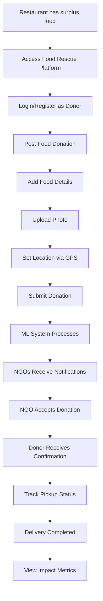
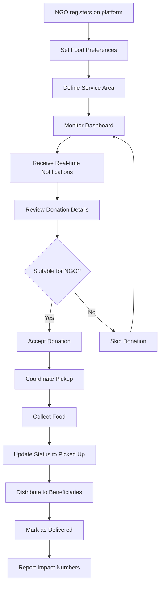
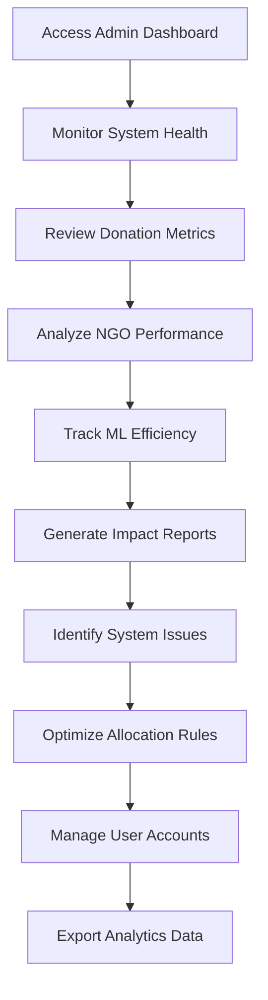
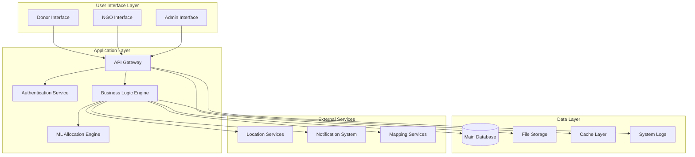
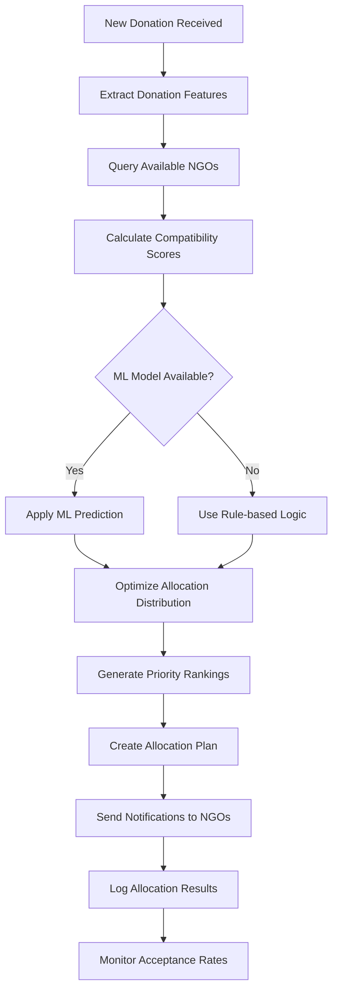
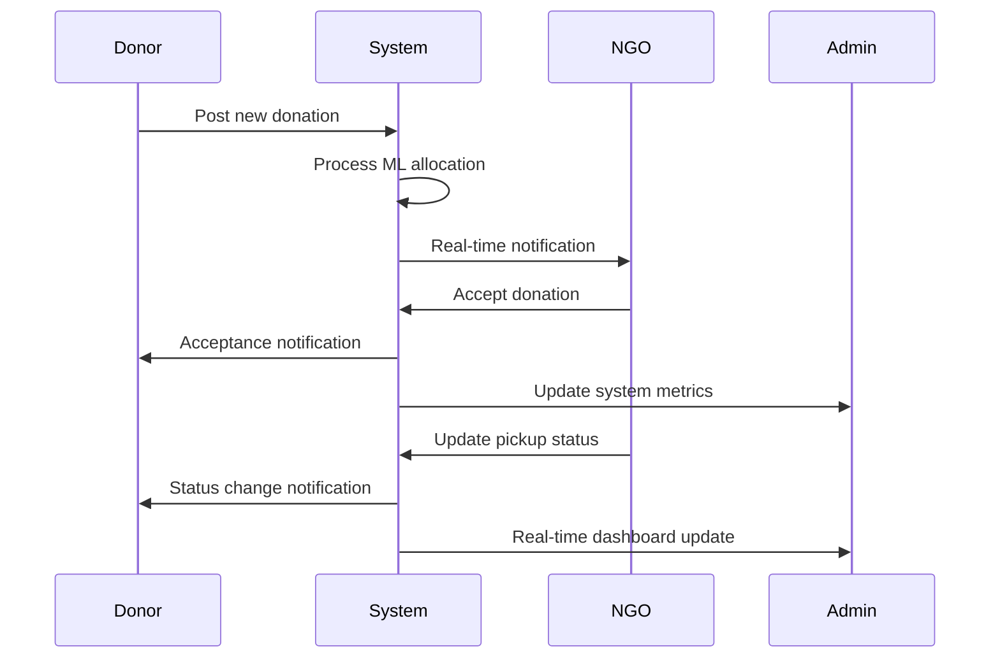
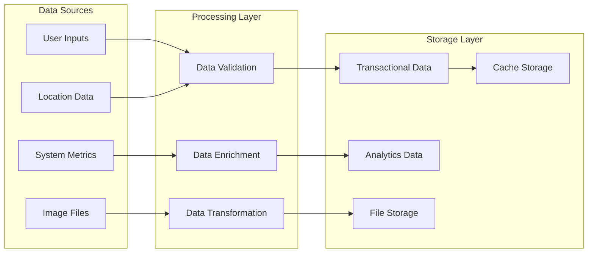
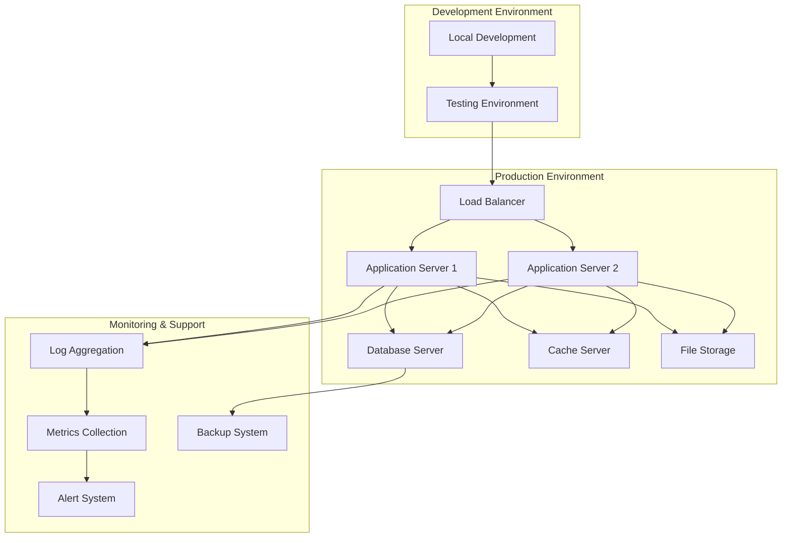
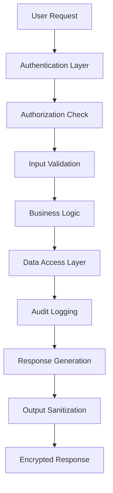
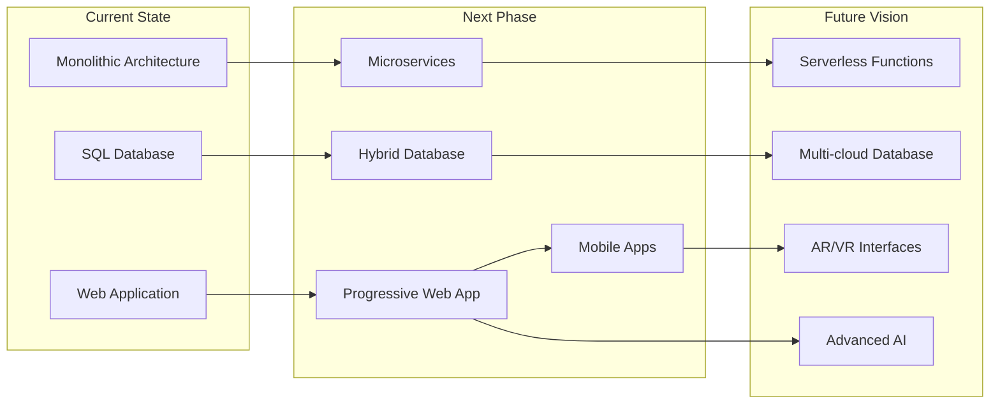

# Food Rescue Matchmaker - System Documentation

## 📋 Table of Contents

1. [System Overview](#system-overview)
2. [User Workflows](#user-workflows)
3. [System Architecture](#system-architecture)
4. [ML Allocation Process](#ml-allocation-process)
5. [Real-time Communication](#real-time-communication)
6. [Data Management](#data-management)
7. [Deployment & Operations](#deployment--operations)
8. [System Performance](#system-performance)
9. [Security & Privacy](#security--privacy)
10. [Future Roadmap](#future-roadmap)

---

## 🎯 System Overview

### Purpose
The Food Rescue Matchmaker is an intelligent platform designed to bridge the gap between food waste and food insecurity. It connects restaurants and cafes with surplus food to NGOs and community organizations for efficient redistribution.

### Core Value Proposition
- **Reduce Food Waste**: Minimize food wastage from commercial establishments
- **Address Food Insecurity**: Ensure surplus food reaches those in need
- **Optimize Distribution**: Use AI to match donations with the most suitable NGOs
- **Real-time Coordination**: Enable instant communication between donors and recipients
- **Impact Tracking**: Measure and report social and environmental impact

### Key Stakeholders
- **Donors**: Restaurants, cafes, caterers with surplus food
- **Recipients**: NGOs, shelters, community kitchens, food banks
- **Administrators**: Platform managers monitoring system performance
- **Beneficiaries**: End users receiving redistributed food

### Technology Foundation
- **Backend**: Python-based API server with machine learning capabilities
- **Database**: Relational database with optimized querying
- **Frontend**: Single-page web application with mobile responsiveness
- **Real-time**: WebSocket-based instant messaging system
- **Intelligence**: Machine learning for optimal allocation decisions

---

## 👥 User Workflows

### Donor (Restaurant) Journey

#### Detailed Donor Process
1. **Food Identification**: Restaurant identifies surplus food suitable for donation
2. **Platform Access**: Opens web application on mobile device or computer
3. **Authentication**: Quick login or registration process
4. **Donation Creation**: Fills out donation form with:
   - Restaurant name and contact details
   - Food type selection (vegetarian, non-vegetarian, dairy, etc.)
   - Detailed food description
   - Quantity estimation (number of servings)
   - Expiry timeframe
5. **Documentation**: Takes and uploads photo of food items
6. **Location Setting**: Uses high-accuracy GPS or manual address entry
7. **Submission**: Confirms donation details and submits
8. **Automatic Processing**: System immediately triggers ML allocation
9. **Status Monitoring**: Receives real-time updates on donation status
10. **Impact Visibility**: Views metrics on meals saved and people helped

### NGO (Recipient) Journey

#### Detailed NGO Process
1. **Registration**: NGO signs up and provides organization details
2. **Preference Setting**: Selects accepted food types and dietary restrictions
3. **Capacity Definition**: Sets daily/weekly capacity for food handling
4. **Geographic Coverage**: Defines service area and pickup radius
5. **Dashboard Monitoring**: Continuously monitors available donations
6. **Smart Notifications**: Receives targeted alerts for compatible donations
7. **Quick Assessment**: Reviews donation details, photos, and location
8. **Acceptance Decision**: One-click acceptance of suitable donations
9. **Pickup Coordination**: Contacts donor for pickup arrangement
10. **Status Updates**: Reports pickup and delivery progress
11. **Impact Reporting**: Records number of beneficiaries served

### Administrator Workflow

---

## 🏗️ System Architecture

### High-Level Architecture Flow

### Component Responsibilities

#### User Interface Layer
- **Donor Interface**: Food posting, photo upload, status tracking
- **NGO Interface**: Donation browsing, acceptance workflow, impact reporting
- **Admin Interface**: System monitoring, analytics, user management

#### Application Layer
- **API Gateway**: Request routing, rate limiting, response formatting
- **Authentication Service**: User login, session management, role-based access
- **Business Logic Engine**: Core application workflows and rules
- **ML Allocation Engine**: Intelligent matching and optimization

#### Data Layer
- **Main Database**: Persistent storage for all application data
- **File Storage**: Photo and document management
- **Cache Layer**: Performance optimization for frequent queries
- **System Logs**: Audit trails and debugging information

#### External Services
- **Location Services**: GPS coordinates and address validation
- **Notification System**: Real-time alerts and messaging
- **Mapping Services**: Geographic visualization and routing

---

## 🤖 ML Allocation Process

### Intelligent Matching Workflow

### Decision Factors

#### Primary Matching Criteria
1. **Food Type Compatibility**: Matches donation types with NGO preferences
2. **Geographic Proximity**: Optimizes for pickup efficiency and food freshness
3. **Capacity Availability**: Ensures NGOs can handle the donation volume
4. **Urgency Level**: Prioritizes donations with shorter expiry windows

#### Advanced ML Features
1. **Historical Performance**: Uses past success rates for better predictions
2. **Time Pattern Analysis**: Considers NGO availability patterns
3. **Seasonal Adjustments**: Adapts to changing demand patterns
4. **Quality Scoring**: Factors in photo analysis and description quality

#### Allocation Optimization
1. **Partial Splitting**: Divides large donations across multiple NGOs
2. **Backup Assignments**: Provides secondary options if primary fails
3. **Load Balancing**: Distributes donations evenly among capable NGOs
4. **Emergency Prioritization**: Fast-tracks urgent donations

### Learning and Improvement
- **Feedback Integration**: Learns from acceptance/rejection patterns
- **Success Tracking**: Monitors completed delivery rates
- **Model Retraining**: Periodic updates based on new data
- **Performance Metrics**: Continuous monitoring of allocation efficiency

---

## 🔄 Real-time Communication

### WebSocket Communication Flow

### Notification Types

#### For Donors
- **Allocation Confirmation**: When NGOs are notified about donation
- **Acceptance Alerts**: When an NGO accepts the donation
- **Pickup Confirmations**: When food is collected
- **Delivery Updates**: When food reaches beneficiaries
- **Impact Reports**: Periodic summaries of contribution

#### For NGOs
- **New Donations**: Targeted alerts for compatible food items
- **Urgent Notifications**: High-priority alerts for time-sensitive donations
- **Allocation Updates**: When they're selected for specific donations
- **System Announcements**: Platform updates and important notices

#### For Administrators
- **System Health**: Performance metrics and error alerts
- **User Activity**: Registration and engagement statistics
- **Allocation Efficiency**: ML performance and success rates
- **Impact Milestones**: Achievement of significant metrics

### Connection Management
- **Automatic Reconnection**: Handles network interruptions gracefully
- **Connection Pooling**: Efficient resource management
- **Targeted Messaging**: Role-based and preference-based filtering
- **Fallback Mechanisms**: Email/SMS backup for critical notifications

---

## 💾 Data Management

### Data Flow Architecture

### Data Categories

#### Operational Data
- **Donation Records**: Food details, quantities, locations, status
- **NGO Profiles**: Organization details, preferences, capacity
- **User Accounts**: Authentication, roles, preferences
- **Pickup Records**: Collection and delivery tracking

#### Analytical Data
- **Performance Metrics**: System efficiency and usage statistics
- **ML Training Data**: Historical allocation outcomes
- **Impact Measurements**: Social and environmental benefits
- **User Behavior**: Platform usage patterns and preferences

#### Supporting Data
- **Geographic Data**: Location coordinates and address mappings
- **Media Files**: Food photos and documentation
- **System Logs**: Audit trails and error tracking
- **Configuration Data**: System settings and parameters

### Data Quality Assurance
- **Input Validation**: Real-time verification of user-provided data
- **Duplicate Detection**: Prevention of redundant records
- **Consistency Checks**: Cross-reference validation across related data
- **Data Cleansing**: Automated correction of common errors

### Privacy and Security
- **Data Minimization**: Collect only necessary information
- **Access Controls**: Role-based data access restrictions
- **Encryption**: Secure storage and transmission
- **Retention Policies**: Automated data lifecycle management

---

## 🚀 Deployment & Operations

### Deployment Architecture

### Operational Workflows

#### Deployment Process
1. **Code Integration**: Merge tested code changes
2. **Automated Testing**: Run comprehensive test suite
3. **Staging Deployment**: Deploy to staging environment
4. **Quality Assurance**: Manual and automated testing
5. **Production Deployment**: Controlled rollout to production
6. **Health Monitoring**: Post-deployment system verification
7. **Rollback Capability**: Quick reversion if issues arise

#### Monitoring and Maintenance
1. **System Health Checks**: Continuous monitoring of all components
2. **Performance Metrics**: Response times, throughput, error rates
3. **User Experience Monitoring**: Frontend performance and usability
4. **Database Optimization**: Query performance and index management
5. **Security Scanning**: Regular vulnerability assessments
6. **Backup Verification**: Regular backup testing and recovery drills

#### Scaling Strategies
1. **Horizontal Scaling**: Add more application servers
2. **Database Optimization**: Implement read replicas and sharding
3. **Caching Enhancement**: Expand cache coverage and capacity
4. **CDN Integration**: Global content delivery optimization
5. **Microservices Migration**: Break down monolithic components

---

## 📊 System Performance

### Key Performance Indicators

#### User Experience Metrics
- **Page Load Time**: < 2 seconds for initial page load
- **API Response Time**: < 200ms for standard operations
- **Real-time Latency**: < 100ms for WebSocket notifications
- **Photo Upload Speed**: < 5 seconds for 5MB images
- **Search Response**: < 500ms for donation queries

#### System Efficiency Metrics
- **Allocation Accuracy**: > 90% successful matches
- **ML Processing Time**: < 3 seconds for allocation decisions
- **Database Query Performance**: < 50ms for standard queries
- **Concurrent User Capacity**: Support for 1000+ simultaneous users
- **Uptime Availability**: 99.9% system availability target

#### Business Impact Metrics
- **Donation Success Rate**: Percentage of donations that reach beneficiaries
- **NGO Engagement**: Average response time and acceptance rates
- **Food Waste Reduction**: Tonnage of food saved from disposal
- **Social Impact**: Number of people fed through the platform
- **Geographic Coverage**: Areas served and density of operations

### Performance Optimization Strategies

#### Frontend Optimization
- **Code Splitting**: Load only necessary application components
- **Image Compression**: Automatic photo optimization
- **Caching Strategy**: Intelligent browser and CDN caching
- **Progressive Loading**: Prioritize critical content first

#### Backend Optimization
- **Database Indexing**: Optimize queries for faster data retrieval
- **Connection Pooling**: Efficient database connection management
- **Asynchronous Processing**: Non-blocking operations for better throughput
- **Memory Management**: Optimize resource utilization

#### Infrastructure Optimization
- **Auto-scaling**: Dynamic resource allocation based on demand
- **Geographic Distribution**: Deploy servers closer to users
- **Load Balancing**: Distribute traffic efficiently across servers
- **Monitoring Integration**: Proactive performance issue detection

---

## 🔒 Security & Privacy

### Security Framework

### Security Measures

#### Authentication & Authorization
- **Multi-factor Authentication**: Optional 2FA for enhanced security
- **Role-based Access Control**: Granular permissions by user type
- **Session Management**: Secure session handling and timeout
- **Password Security**: Strong password requirements and hashing

#### Data Protection
- **Encryption at Rest**: Database and file storage encryption
- **Encryption in Transit**: HTTPS/WSS for all communications
- **Personal Data Handling**: Minimal collection and secure processing
- **Geographic Data**: Optional location sharing with privacy controls

#### System Security
- **Input Sanitization**: Prevention of injection attacks
- **Rate Limiting**: Protection against abuse and DoS attacks
- **Security Headers**: Implementation of security best practices
- **Vulnerability Scanning**: Regular security assessments

### Privacy Considerations

#### Data Collection Principles
- **Transparency**: Clear communication about data usage
- **Consent**: Explicit user permission for data processing
- **Minimization**: Collect only necessary information
- **Purpose Limitation**: Use data only for stated purposes

#### User Rights
- **Data Access**: Users can view their stored information
- **Data Portability**: Export functionality for user data
- **Data Deletion**: Right to be forgotten implementation
- **Correction Rights**: Ability to update incorrect information

---

## 🔮 Future Roadmap

### Planned Enhancements

#### Short-term (3-6 months)
- **Mobile Applications**: Native iOS and Android apps
- **Advanced Analytics**: Predictive demand forecasting
- **Integration APIs**: Connect with existing NGO management systems
- **Multi-language Support**: Localization for different regions

#### Medium-term (6-12 months)
- **AI-powered Quality Assessment**: Automated food quality evaluation
- **Route Optimization**: Delivery route planning and optimization
- **Blockchain Integration**: Supply chain transparency and traceability
- **IoT Sensors**: Real-time food condition monitoring

#### Long-term (1-2 years)
- **Predictive Analytics**: Forecast food surplus and demand patterns
- **Marketplace Features**: Connect with food recovery organizations
- **Government Integration**: Interface with food safety and regulation systems
- **Global Expansion**: Multi-region deployment with local customization

### Technology Evolution

### Impact Goals
- **Scale**: Serve 10,000+ daily donations across multiple cities
- **Efficiency**: Achieve 95% successful donation completion rate
- **Coverage**: Expand to 50+ cities with localized operations
- **Partnerships**: Integrate with 100+ major food service providers
- **Social Impact**: Facilitate feeding of 1 million+ people annually

---

## 📞 Support & Maintenance

### System Monitoring
- **24/7 Uptime Monitoring**: Continuous system health checks
- **Performance Dashboards**: Real-time metrics and alerts
- **User Feedback Integration**: In-app feedback and support requests
- **Error Tracking**: Automated error detection and reporting

### Maintenance Schedule
- **Daily**: System health checks and performance monitoring
- **Weekly**: Database optimization and backup verification
- **Monthly**: Security updates and vulnerability patches
- **Quarterly**: Feature updates and system improvements

### Support Channels
- **In-app Help**: Contextual help and FAQ integration
- **Email Support**: Dedicated support team for complex issues
- **Community Forum**: Peer-to-peer help and best practices sharing
- **Emergency Contact**: 24/7 support for critical system issues

---

**Document Version**: 1.0  
**Last Updated**: September 17, 2025  
**Next Review**: October 17, 2025  
**Status**: Active System Documentation