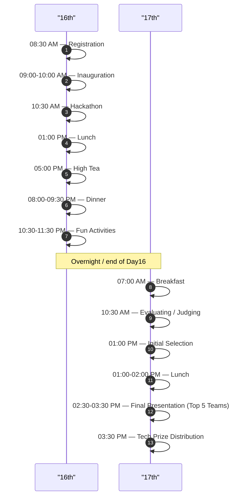

| Date    | Time             | Activity              |
|---------|------------------|-----------------------|
| **16th** | 8:30 AM          | Registration          |
| 16th    | 9:00 – 10:00 AM  | Inauguration          |
| 16th    | 10:30 AM         | Hackathon             |
| 16th    | 1:00 PM          | Lunch                 |
| 16th    | 5:00 PM          | High Tea              |
| 16th    | 8:00 – 9:30 PM   | Dinner                |
| 16th    | 10:30 – 11:30 PM | Fun Activities        |
| **17th** | 7:00 AM          | Breakfast             |
| 17th    | 10:30 AM         | Evaluating / Judging  |
| 17th    | 1:00 PM          | Initial Selection     |
| 17th    | 1:00 – 2:00 PM   | Lunch                 |
| 17th    | 2:30 – 3:30 PM   | Final Presentation *(Top 5 Teams)* |
| 17th    | 3:30 PM          | Tech Prize Distribution |

***
