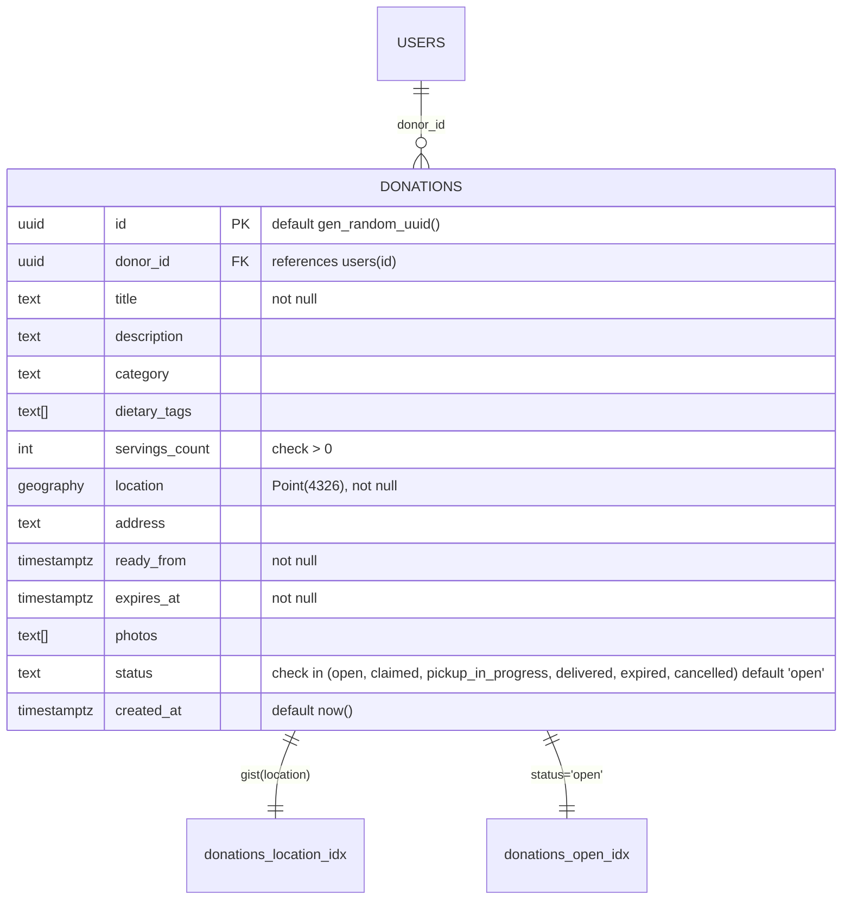

```mermaid
erDiagram
    USERS ||--o{ DONATIONS : "donor_id"

    DONATIONS {
        uuid id PK "default gen_random_uuid()"
        uuid donor_id FK "references users(id)"
        text title "not null"
        text description
        text category
        text[] dietary_tags
        int servings_count "check > 0"
        geography location "Point(4326), not null"
        text address
        timestamptz ready_from "not null"
        timestamptz expires_at "not null"
        text[] photos
        text status "check in (open, claimed, pickup_in_progress, delivered, expired, cancelled) default 'open'"
        timestamptz created_at "default now()"
    }

    %% Indexes
    DONATIONS ||--|| donations_location_idx : "gist(location)"
    DONATIONS ||--|| donations_open_idx : "status='open'"


```