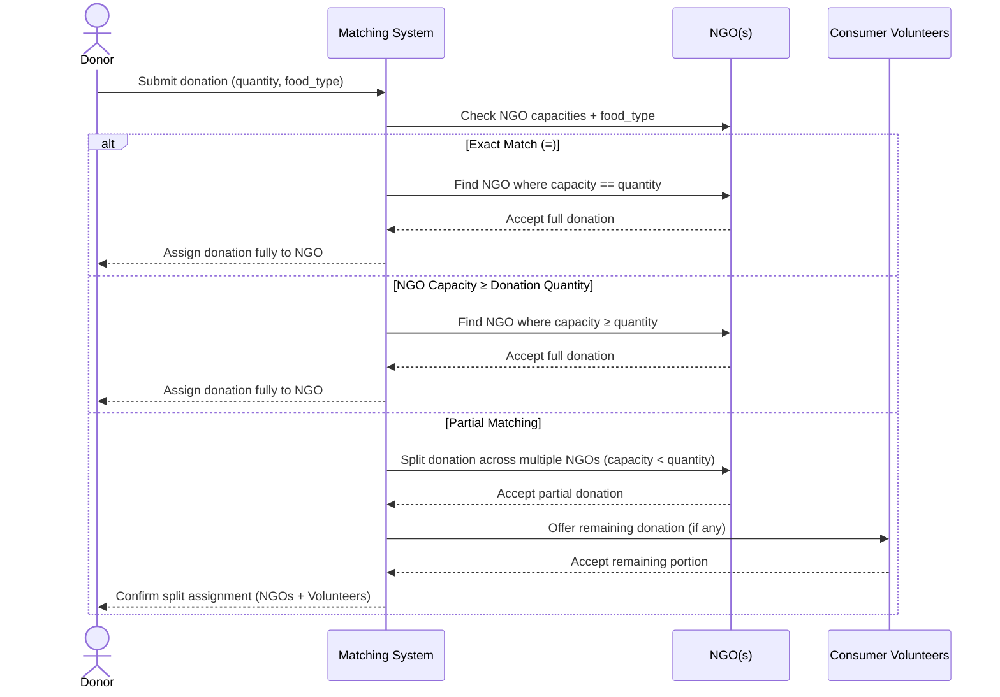

```mermaid
sequenceDiagram
    actor Donor
    participant MatchingSystem as Matching System
    participant NGO as NGO(s)
    participant Volunteers as Consumer Volunteers

    Donor->>MatchingSystem: Submit donation (quantity, food_type)

    MatchingSystem->>NGO: Check NGO capacities + food_type

    alt Exact Match (=)
        MatchingSystem->>NGO: Find NGO where capacity == quantity
        NGO-->>MatchingSystem: Accept full donation
        MatchingSystem-->>Donor: Assign donation fully to NGO
    else NGO Capacity ≥ Donation Quantity
        MatchingSystem->>NGO: Find NGO where capacity ≥ quantity
        NGO-->>MatchingSystem: Accept full donation
        MatchingSystem-->>Donor: Assign donation fully to NGO
    else Partial Matching
        MatchingSystem->>NGO: Split donation across multiple NGOs (capacity < quantity)
        NGO-->>MatchingSystem: Accept partial donation
        MatchingSystem->>Volunteers: Offer remaining donation (if any)
        Volunteers-->>MatchingSystem: Accept remaining portion
        MatchingSystem-->>Donor: Confirm split assignment (NGOs + Volunteers)
    end


```